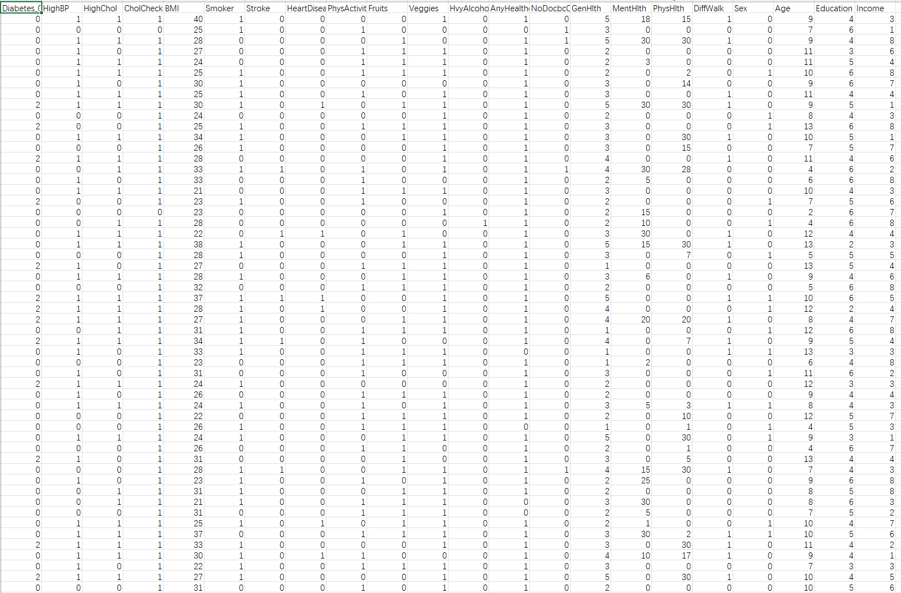
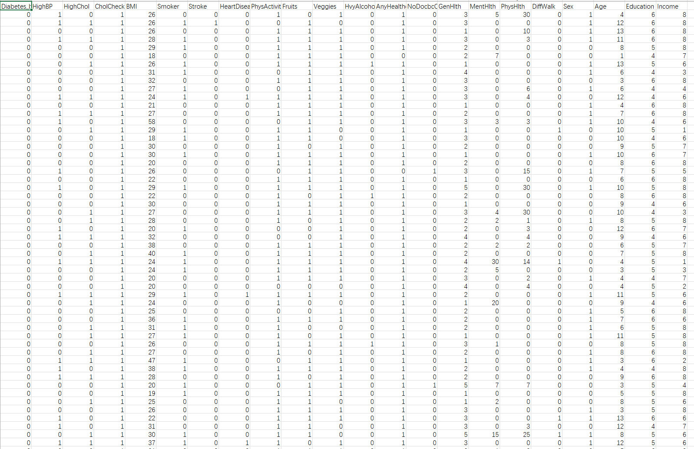
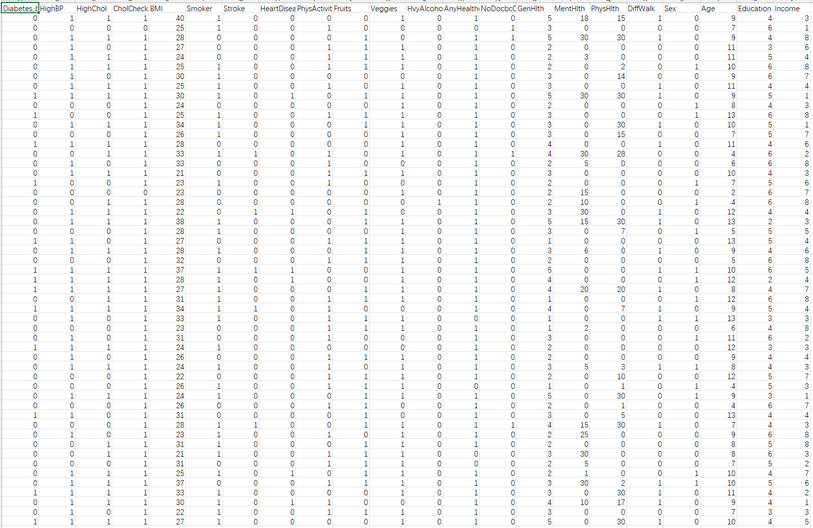

## Body

糖尿病健康指标数据集

本数据集使用了2015年Kaggle上可得数据集的csv。该原始数据集包含441,455名个体的响应，包含330个特征。这些特征要么是直接向参与者提问的问题，要么是基于个别参与者回答计算出的变量。

该数据集包含3个文件：
--------糖尿病 _ 012 _ 健康 _ 指标 _ BRFSS2015.csv 是一个干净的数据集，包含CDC的253,680份调查回复，BRFSS2015。目标变量Diabetes_012有3个类。0是无糖尿病或仅怀孕期间，1是糖尿病前期，2是糖尿病。该数据集中存在阶级不平衡。该数据集包含21个特征变量
--------糖尿病 _ 二元性别 _ 5050 分裂 _ 健康 _ 指标 _ BRFSS2015.csv 是一个干净的数据集，包含CDC的70,692份调查回复，BRFSS2015。无糖尿病患者和糖尿病前期或糖尿病患者比例为50比50。目标变量Diabetes_binary有两个类。0代表无糖尿病，1代表糖尿病前期或糖尿病。该数据集包含21个特征变量，且是平衡的。
--------糖尿病 _ 二元性别 _ 健康 _ 指标 _ BRFSS2015.csv 是一个干净的数据集，包含CDC的253,680份调查回复，BRFSS2015。目标变量Diabetes_binary有两个类。0代表无糖尿病，1代表糖尿病前期或糖尿病。该数据集包含21个特征变量，且不平衡。

## Images

item_1047793763815

Here is a pay link on Stripe ( https://buy.stripe.com/3cs8yP7sY87d0vu9AB ). Please contact me lonlonago@foxmail.com after funding $89, and I will send you a complete data files , thank you!

